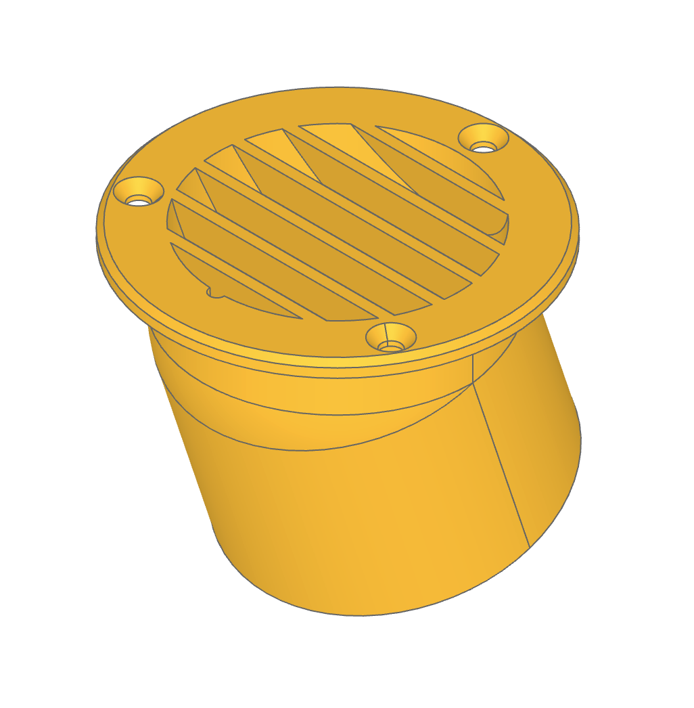

# Diesel Heater Intake Vent

[**View model**](./diesel-heater-vent.stl)

I recently installed a Vevor 2KW diesel heater on my sailboat (which I'll get around to writing about in a more detailed article eventually).

One of the challenges I encountered is with air intake; in automotive applications the heater is typically installed either on the interior or underside of the car, where it's safe to simply suck in the intake air from the installation location. However, on a sailboat the heater is typically installed in the engine compartment, which is full of smelly, stale air (at best; at worst it becomes toxic carbon monoxide if you have any exhaust leaks). So you need to install ducting and a vent to intake fresh air from the exterior. 

Most of the vents available on Amazon or other sites are designed for interior use only and are not UV or water resistant. The few that I could find that looked like they would resist water ingress required giant holes for installation, which I was not interested in drilling in my cockpit seatwell.

So I've designed my own to be 3D printed in UV-resistant PETG, meeting the following simple requirements:

- Matches the size of the heater intake port (60mm diameter) so that the same ducting fits both ends
- Resists water ingress with louvers to shed water, plus the duct attachment point tilts upwards so any water that does make it in drains back out
- Fits nearly flush so that it doesn't take up valuable space or get caught on things
- Is designed for 3D printing
- Is aesthetically pleasing
- Supports a simple installation with three flathead screws

## Printing this part

Download the pre-compiled model files:

- [STL format](./diesel-heater-vent.stl)
- [3mf format](./diesel-heater-vent.3mf)

Note that for marine purposes the model should be printed in PETG. Sufficient perimeters should be used such that no infill is used in the walls.

## Customization / self-compiling

This model was created with [build123d](https://github.com/gumyr/build123d), which is an excellent parametric 3D CAD library for Python. The source code for the model is [`./diesel-heater-vent.py`](./diesel-heater-vent.py).

If you want to create your own variations of the model, the simplest way to preview and build the file is to [work in a Codespace](https://codespaces.new/iansan5653/diesel-heater-vent) for this repository; the OCP Viewer extension and Python will be preinstalled for you. Alternatively, you can install the [OCP Viewer](https://github.com/bernhard-42/vscode-ocp-cad-viewer) extension yourself, or install build123d using any of the supported approaches from the [docs](https://build123d.readthedocs.io/en/latest/installation.html).
